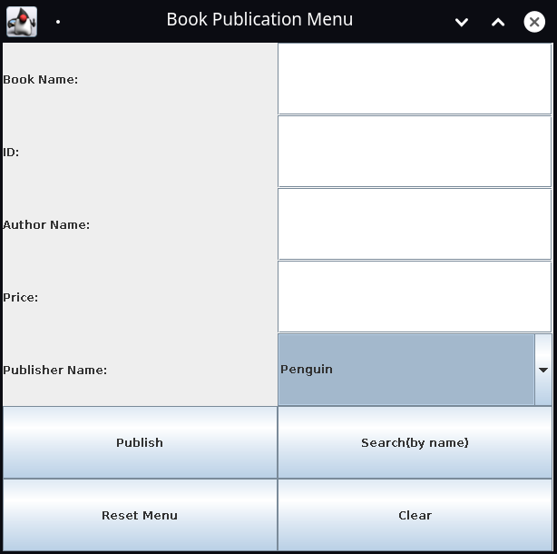

### Book Publication
  
  ## Abstract
  >*Book Publication is java swing based GUI application to keep records.*
  
  
  ## Installation
  Use IntelliJ Idea or  
  
  Manually  go to ```/src``` and open ```terminal/cmd```   
  Compile: 
  
  ```bash
  javac *.java
  ```
  
  run.
  ```bash 
  java Main
  ```
  
  
  ## Usage
  >
  
  
  ## Conculasion
  ```
 This is a very basic level of java project using files to store data.   
 I wrote thiis code somewhere between December, 2015 while I was started to learn Java.
  ```
